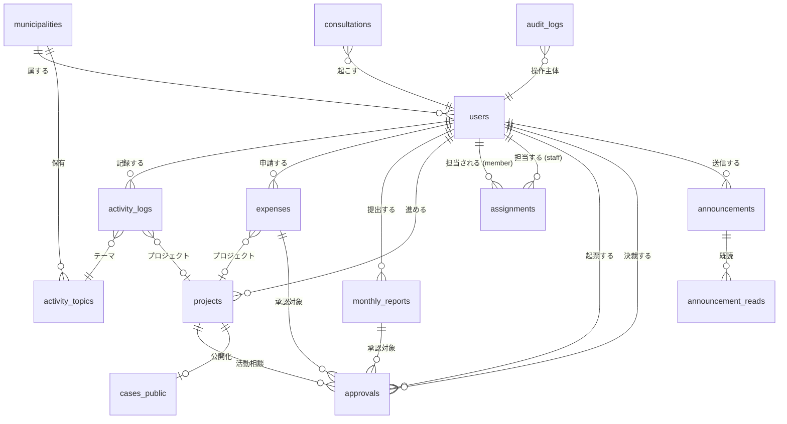

# v5 データモデル設計書

`docs/21_v5_technical_design.md` のアーキテクチャを支えるデータモデル。
Supabase Postgres を前提とし、RLS でマルチテナント分離する。

## 1. ER 図(概念)



## 2. テーブル一覧

### マスター
- `municipalities` ─ 自治体
- `users` ─ 全ロールのユーザー(隊員 / 役場職員 / 管理者)
- `activity_topics` ─ 活動内容(ユーザー固有)

### 活動・記録
- `activity_logs` ─ 活動報告 1 件
- `projects` ─ プロジェクト(ライフサイクル管理)
- `monthly_reports` ─ 月報
- `expenses` ─ 経費(申請 / 精算)

### ワークフロー
- `approvals` ─ 承認ワークフロー(汎用、kind で分岐)
- `assignments` ─ 職員 × 隊員 担当割当
- `announcements` ─ お知らせ
- `announcement_reads` ─ お知らせ既読
- `consultations` ─ AI 相談ログ

### ナレッジ
- `cases_public` ─ 全国事例(匿名化済、公開)
- `guidelines` ─ 自治体ガイドライン(経費 RAG の元データ)

### 監査
- `audit_logs` ─ 操作監査

## 3. テーブル定義

### 3.1 municipalities

| カラム | 型 | NOT NULL | 説明 |
|---|---|---|---|
| id | uuid | ✓ | PK |
| name | text | ✓ | 自治体名(例:新温泉町) |
| prefecture | text | ✓ | 都道府県(例:兵庫県) |
| settings | jsonb |  | 自治体ごとの設定(年間活動費上限等) |
| created_at | timestamptz | ✓ | |

### 3.2 users

| カラム | 型 | NOT NULL | 説明 |
|---|---|---|---|
| id | uuid | ✓ | PK(`auth.users.id` と同期) |
| municipality_id | uuid | ✓ | FK → municipalities |
| role | text | ✓ | `member` / `manager` / `admin` |
| name | text | ✓ | 表示名 |
| email | text | ✓ | UNIQUE |
| role_label | text |  | 隊員の役割(例:移住促進) |
| title | text |  | 役場職員の役職 |
| department | text |  | 役場職員の所属課 |
| term | text |  | 隊員の任期(例:1 年目) |
| started_at | date |  | 着任日 |
| status | text | ✓ | `active` / `retired`(退任) |
| disclose_name_in_cases | bool | ✓ | **事例公開時に実名を出すか(opt-in、デフォルト false)** |
| bio | text |  | プロフィール紹介文(公開事例の隊員プロフィールに表示) |
| contact_form_enabled | bool | ✓ | 連絡フォーム受付(Year 2、デフォルト false) |
| created_at | timestamptz | ✓ | |
| updated_at | timestamptz | ✓ | |

**インデックス:**
- `(municipality_id, role)`
- `(municipality_id, status)`

### 3.3 activity_topics

| カラム | 型 | NOT NULL | 説明 |
|---|---|---|---|
| id | uuid | ✓ | PK |
| user_id | uuid | ✓ | FK → users(隊員固有) |
| municipality_id | uuid | ✓ | FK → municipalities(RLS 用、冗長) |
| name | text | ✓ | 活動内容名(例:空き家) |
| sort_order | int | ✓ | 表示順 |
| created_at | timestamptz | ✓ | |

**UNIQUE:** `(user_id, name)`

### 3.4 activity_logs

| カラム | 型 | NOT NULL | 説明 |
|---|---|---|---|
| id | uuid | ✓ | PK |
| user_id | uuid | ✓ | FK → users(隊員) |
| municipality_id | uuid | ✓ | FK → municipalities(RLS) |
| project_id | uuid |  | FK → projects(任意紐付け) |
| activity_type | text | ✓ | 活動の種類(会議/出張/...) |
| topic | text | ✓ | 活動内容(activity_topics.name と一致) |
| hours | numeric(4,1) | ✓ | 活動時間(0.5 単位) |
| body | text | ✓ | メモ |
| occurred_at | timestamptz | ✓ | 実際の活動日時 |
| expense_amount | int |  | この活動で発生した経費(円) |
| photo_paths | text[] |  | Storage パス配列 |
| created_at | timestamptz | ✓ | |
| updated_at | timestamptz | ✓ | |

**インデックス:**
- `(user_id, occurred_at DESC)`
- `(municipality_id, occurred_at DESC)`

### 3.5 projects

| カラム | 型 | NOT NULL | 説明 |
|---|---|---|---|
| id | uuid | ✓ | PK |
| user_id | uuid | ✓ | FK → users(オーナー隊員) |
| municipality_id | uuid | ✓ | FK → municipalities |
| name | text | ✓ | プロジェクト名(例:空き家コワーキング) |
| goal | text |  | 目的・ゴール |
| background | text |  | 背景 |
| plan | text |  | 実施計画 |
| kpi | text |  | KPI |
| period_start | date |  | 開始日 |
| period_end | date |  | 終了日 |
| budget | int |  | 予算(円) |
| risk | text |  | リスクと対策 |
| status | text | ✓ | `planning` / `active` / `completed` |
| is_public | bool | ✓ | true で全国事例化 opt-in |
| disclose_name_override | bool |  | NULL = users.disclose_name_in_cases に従う / true / false の上書き |
| anonymized_case_id | uuid |  | FK → cases_public(匿名化後の参照) |
| created_at | timestamptz | ✓ | |
| updated_at | timestamptz | ✓ | |

### 3.6 monthly_reports

| カラム | 型 | NOT NULL | 説明 |
|---|---|---|---|
| id | uuid | ✓ | PK |
| user_id | uuid | ✓ | FK → users |
| municipality_id | uuid | ✓ | FK → municipalities |
| year_month | text | ✓ | "2026-05" |
| status | text | ✓ | `draft` / `submitted` / `approved` / `rejected` |
| summary | text |  | サマリ章 |
| sections | jsonb |  | 5 章の本文配列 `[{title, body}]` |
| plan_next | text |  | 来月計画 |
| activity_count | int | ✓ | 自動集計:活動件数 |
| total_hours | numeric(6,1) | ✓ | 自動集計:総活動時間 |
| total_expense | int | ✓ | 自動集計:総経費 |
| submitted_at | timestamptz |  | 提出日時 |
| ai_generated_at | timestamptz |  | AI 生成日時 |
| created_at | timestamptz | ✓ | |
| updated_at | timestamptz | ✓ | |

**UNIQUE:** `(user_id, year_month)`

### 3.7 expenses

| カラム | 型 | NOT NULL | 説明 |
|---|---|---|---|
| id | uuid | ✓ | PK |
| user_id | uuid | ✓ | FK → users |
| municipality_id | uuid | ✓ | FK → municipalities |
| project_id | uuid |  | FK → projects |
| title | text | ✓ | タイトル(例:町報 印刷費) |
| amount_requested | int | ✓ | 申請金額(円) |
| amount_settled | int |  | 実支出額(精算時) |
| purpose | text | ✓ | 用途・内容 |
| status | text | ✓ | `申請中` / `承認` / `差戻し` / `未精算` / `精算済` |
| payee | text |  | 支払先(精算時) |
| paid_date | date |  | 支出日(精算時) |
| receipt_path | text |  | 領収書 Storage パス |
| settle_note | text |  | 精算メモ |
| ai_note | text |  | AI 判定材料(キャッシュ) |
| citations | jsonb |  | 引用 `[{source, quote}]` |
| created_at | timestamptz | ✓ | |
| updated_at | timestamptz | ✓ | |

### 3.8 approvals

承認ワークフローを汎用化(月次 / 経費 / 活動相談)。

| カラム | 型 | NOT NULL | 説明 |
|---|---|---|---|
| id | uuid | ✓ | PK |
| municipality_id | uuid | ✓ | FK → municipalities |
| kind | text | ✓ | `経費` / `月次報告` / `活動相談` |
| applicant_id | uuid | ✓ | FK → users(隊員) |
| approver_id | uuid |  | FK → users(役場担当、決裁者) |
| target_table | text | ✓ | `expenses` / `monthly_reports` / `projects` |
| target_id | uuid | ✓ | 対象レコード ID |
| status | text | ✓ | `pending` / `approved` / `rejected` |
| ai_note | text |  | AI 判定材料 |
| citations | jsonb |  | 引用 |
| comment | text |  | 役場コメント(差戻し時必須) |
| approved_at | timestamptz |  | |
| created_at | timestamptz | ✓ | |

**インデックス:**
- `(municipality_id, status)`
- `(applicant_id, status)`

### 3.9 assignments

| カラム | 型 | NOT NULL | 説明 |
|---|---|---|---|
| id | uuid | ✓ | PK |
| municipality_id | uuid | ✓ | FK → municipalities |
| staff_id | uuid | ✓ | FK → users(役場担当) |
| member_id | uuid | ✓ | FK → users(隊員) |
| created_at | timestamptz | ✓ | |

**UNIQUE:** `(staff_id, member_id)`

### 3.10 announcements

| カラム | 型 | NOT NULL | 説明 |
|---|---|---|---|
| id | uuid | ✓ | PK |
| municipality_id | uuid | ✓ | FK → municipalities |
| sender_id | uuid | ✓ | FK → users(役場担当) |
| title | text | ✓ | (本文先頭から自動抽出可能) |
| body | text | ✓ | お知らせ本文 |
| target_user_ids | uuid[] | ✓ | 送信先隊員 ID 配列 |
| sent_at | timestamptz | ✓ | |
| created_at | timestamptz | ✓ | |

### 3.11 announcement_reads

| カラム | 型 | NOT NULL | 説明 |
|---|---|---|---|
| announcement_id | uuid | ✓ | PK(複合) |
| user_id | uuid | ✓ | PK(複合) |
| read_at | timestamptz | ✓ | |

### 3.12 consultations

AI 相談のログ。学習データではなく、隊員の使用履歴として保持。

| カラム | 型 | NOT NULL | 説明 |
|---|---|---|---|
| id | uuid | ✓ | PK |
| user_id | uuid | ✓ | FK → users |
| municipality_id | uuid | ✓ | FK → municipalities |
| context_kind | text | ✓ | `daily-write` / `report-plan` / `expense-purpose` / `case-find` |
| context_payload | jsonb |  | 入力時のコンテキスト |
| input_text | text | ✓ | ユーザー入力 |
| output_text | text | ✓ | AI 応答 |
| adopted | bool | ✓ | 「反映して閉じる」を押したか |
| tokens_used | int |  | コスト集計用 |
| created_at | timestamptz | ✓ | |

### 3.13 cases_public

**ADR-011 に準拠した公開事例。隊員は実名 opt-in、関係者は自動匿名化、自治体名は常に公開。**

| カラム | 型 | NOT NULL | 説明 |
|---|---|---|---|
| id | uuid | ✓ | PK |
| source_project_id | uuid | ✓ | 元プロジェクト ID(隊員側で参照可能) |
| source_municipality_id | uuid | ✓ | 元自治体 ID(常に公開:`municipality_name` を結合表示) |
| source_user_id | uuid |  | 元隊員 ID(opt-in 時のみ非 NULL、隊員プロフィールへの導線) |
| municipality_name | text | ✓ | 例:「新温泉町」(常に公開) |
| prefecture | text | ✓ | 例:「兵庫県」 |
| disclose_author | bool | ✓ | true なら隊員名を author_label に表示 |
| author_label | text | ✓ | opt-in:「田中 あかり」/ opt-out:「移住促進担当」 |
| year | text | ✓ | 例:"2024" |
| title | text | ✓ | |
| summary | text | ✓ | **関係者匿名化済**(個人名 → 「A さん」、民間企業 → 「地元の小売店」) |
| kpi | text |  | |
| effect | text |  | |
| process | jsonb |  | プロセス配列(各 phase.body も匿名化済) |
| learning | text |  | 学び(匿名化済) |
| original_text | text |  | 匿名化前テキスト(自治体内のみ参照可、監査用) |
| anonymized_at | timestamptz | ✓ | 匿名化処理完了日時 |
| anonymized_by_review | bool | ✓ | 隊員レビュー完了済か(false なら下書き状態) |
| embedding | vector(1536) |  | pgvector 用 |
| created_at | timestamptz | ✓ | |

**インデックス:**
- HNSW on `embedding`(類似検索)
- 全文検索 GIN on `title || summary || learning`
- `(prefecture, municipality_name)` で自治体別検索

**RLS:**
- `anonymized_by_review = true` の行のみ全テナントから SELECT 可能
- 下書き状態(`anonymized_by_review = false`)は原著隊員と同自治体管理者のみ参照可能
- `original_text` は同自治体ユーザーのみ参照可能(他テナントは NULL マスク)
- INSERT は Edge Function(匿名化処理経由)のみ
- UPDATE は原著隊員(`source_user_id`)が `anonymized_by_review` のトグルのみ可能

**匿名化方針(ADR-011):**
- **隊員名:** `disclose_author = true` なら実名、false なら役割名
- **自治体名:** 常に公開
- **関係者 個人名 → 匿名化**(「A さん」「住民の方」)
- **民間企業 → 匿名化**(「地元の小売店」「町内の建設会社」)
- **公的団体(自治会・観光協会・学校等)→ 実名で残す**(文脈価値を保つため)

### 3.14 guidelines

自治体ごとの活動費ガイドライン(経費 RAG の元データ)。

| カラム | 型 | NOT NULL | 説明 |
|---|---|---|---|
| id | uuid | ✓ | PK |
| municipality_id | uuid | ✓ | FK → municipalities |
| source | text | ✓ | 例:「新温泉町 活動費ガイドライン v2.1」 |
| section | text | ✓ | 章タイトル |
| body | text | ✓ | 条文本文 |
| embedding | vector(1536) |  | pgvector 用 |
| created_at | timestamptz | ✓ | |

### 3.15 audit_logs

| カラム | 型 | NOT NULL | 説明 |
|---|---|---|---|
| id | uuid | ✓ | PK |
| municipality_id | uuid | ✓ | FK → municipalities |
| actor_id | uuid | ✓ | FK → users |
| action | text | ✓ | 例:`approve` / `reject` / `member.retire` |
| target_table | text | ✓ | |
| target_id | uuid | ✓ | |
| diff | jsonb |  | 変更前後 |
| created_at | timestamptz | ✓ | |

**インデックス:**
- `(municipality_id, created_at DESC)`
- `(target_table, target_id)`

## 4. RLS ポリシー(主要 7 件)

```sql
-- 1. activity_logs: 隊員 = 自分のみ / 役場 = 管轄隊員 / 管理者 = 自治体全員
CREATE POLICY "activity_logs_select" ON activity_logs FOR SELECT TO authenticated USING (
  municipality_id = current_municipality_id()
  AND (
    user_id = auth.uid()
    OR EXISTS (SELECT 1 FROM assignments WHERE staff_id = auth.uid() AND member_id = activity_logs.user_id)
    OR is_admin()
  )
);

-- 2. expenses: 同上
CREATE POLICY "expenses_select" ON expenses FOR SELECT TO authenticated USING (...);

-- 3. monthly_reports: 同上
CREATE POLICY "monthly_reports_select" ON monthly_reports FOR SELECT TO authenticated USING (...);

-- 4. approvals: 起票者 / 決裁者 / 管理者
CREATE POLICY "approvals_select" ON approvals FOR SELECT TO authenticated USING (
  municipality_id = current_municipality_id()
  AND (applicant_id = auth.uid() OR approver_id = auth.uid() OR is_manager_for(applicant_id) OR is_admin())
);

-- 5. cases_public: 全テナント SELECT 可能
CREATE POLICY "cases_public_select" ON cases_public FOR SELECT TO authenticated USING (true);

-- 6. assignments: 自治体内のみ参照可能
CREATE POLICY "assignments_select" ON assignments FOR SELECT TO authenticated USING (
  municipality_id = current_municipality_id()
);

-- 7. announcements: 送信者 / 受信対象 / 管理者
CREATE POLICY "announcements_select" ON announcements FOR SELECT TO authenticated USING (
  municipality_id = current_municipality_id()
  AND (sender_id = auth.uid() OR auth.uid() = ANY(target_user_ids) OR is_admin())
);
```

**ヘルパー関数:**
```sql
CREATE FUNCTION current_municipality_id() RETURNS uuid AS $$
  SELECT municipality_id FROM users WHERE id = auth.uid();
$$ LANGUAGE sql STABLE;

CREATE FUNCTION is_admin() RETURNS bool AS $$
  SELECT EXISTS (SELECT 1 FROM users WHERE id = auth.uid() AND role = 'admin');
$$ LANGUAGE sql STABLE;
```

## 5. Storage バケット構造

```
receipts/
└── {municipality_id}/
    └── {user_id}/
        └── {expense_id}/{filename}

photos/
└── {municipality_id}/
    └── {user_id}/
        └── {YYYY-MM}/
            └── {activity_log_id}/{filename}

reports/
└── {municipality_id}/
    └── {user_id}/
        └── {year_month}.pdf
```

**ポリシー:**
- 隊員は自分のパス配下のみ R/W
- 役場は管轄隊員のパスを R(W は不可)
- 管理者は自治体内すべて R/W

## 6. Embedding と RAG

### 6.1 Embedding 戦略
- モデル:`text-embedding-3-small`(1536 次元)
- 対象:
  - `cases_public`(全文 = title + summary + learning + process JSON 文字列)
  - `guidelines`(`source + section + body`)
- 更新タイミング:
  - 事例:Edge Function の cron で日次
  - ガイドライン:管理画面で更新時に再計算

### 6.2 検索フロー(経費 RAG)
1. `purpose` を Embedding
2. `cases_public` で類似 3 件取得
3. `guidelines` で同一自治体の関連 1-2 件取得
4. Claude に「判定材料を整理してください」プロンプト
5. キャッシュ:`expenses.ai_note` + `expenses.citations` に保存

## 7. マイグレーション戦略

### 7.1 PoC 時点
- Supabase の SQL Editor で直接スキーマを作成
- マイグレーションファイル(`supabase/migrations/`)で履歴管理

### 7.2 ファイル命名
```
supabase/migrations/
├── 20260612_001_initial.sql       # municipalities, users, RLS 基礎
├── 20260612_002_activities.sql    # activity_logs, projects, topics
├── 20260612_003_expenses.sql      # expenses, approvals
├── 20260612_004_monthly.sql       # monthly_reports
├── 20260612_005_announcements.sql # announcements + reads
├── 20260612_006_ai.sql            # consultations, cases_public, guidelines, embeddings
└── 20260612_007_audit.sql         # audit_logs + triggers
```

### 7.3 シードデータ(PoC)
- 自治体:新温泉町
- 管理者:1 名
- 役場担当:1-2 名
- 隊員:5 名(田中 あかり 等のモック名でも実名でも可)
- 活動内容テンプレ:空き家 / 移住相談 / 町報 / 観光協会 / 夏祭り
- ガイドライン:1 自治体分(10-20 セクション)
- 全国事例:10-30 件(JOIN お役立ちツール Q&A、海士町 / 養父市 / 豊岡 等)

## 8. データ容量見積もり(1 自治体・1 年)

| テーブル | 行数 | 1 行サイズ | 合計 |
|---|---|---|---|
| activity_logs | 5 名 × 250 日 × 2 件 = 2,500 | 2 KB | 5 MB |
| expenses | 5 名 × 20 件 = 100 | 2 KB | 0.2 MB |
| monthly_reports | 5 名 × 12 月 = 60 | 10 KB | 0.6 MB |
| projects | 5 名 × 5 件 = 25 | 4 KB | 0.1 MB |
| approvals | 5 名 × 30 件 = 150 | 1 KB | 0.15 MB |
| announcements | 50 件 | 2 KB | 0.1 MB |
| consultations | 5 名 × 200 件 = 1,000 | 4 KB | 4 MB |
| audit_logs | 5,000 件 | 1 KB | 5 MB |
| **DB 合計** | | | **約 15 MB / 自治体 / 年** |
| Storage(領収書 + 写真) | | | **約 500 MB / 自治体 / 年** |

Supabase Free Tier(500MB DB + 1GB Storage)で 1 自治体 5 年分は余裕。

## 9. バックアップとリストア

- Supabase 標準の **日次バックアップ**(7 日保持、Pro プラン)
- 月次フルダンプを手動で取得し、別リージョン S3 に保存(Year 2)
- リストア手順:管理者がチケット起票 → 24 時間以内に復元

## 10. プライバシー・退任時のデータ取扱

| イベント | データ動作 |
|---|---|
| 隊員退任(active → retired) | データは保持。閲覧は本人 + 管理者のみ可能。 |
| 退任 30 日経過 | 監査ログ以外の個人特定情報をマスク(本人申請でエクスポート可) |
| 完了プロジェクト + opt-in | 匿名化フローで cases_public に投入 |
| 自治体契約解除 | 90 日以内に全データ削除(本人申請でエクスポート可) |

## 11. 将来の拡張(Year 2+)

- `voice_logs` テーブル(Whisper による音声記録)
- `push_subscriptions` テーブル(PWA Push)
- `prefecture_dashboards` テーブル(県横断モード)
- `legislative_reports` テーブル(議会報告 PDF)
- `careers` テーブル(キャリア着地点ナビ)
- **`contact_messages` テーブル(事例 → 隊員への連絡フォーム、ADR-011)**
  - `from_user_id` / `to_user_id` / `case_id` / `body` / `read_at`
  - 隊員のメアドは非公開、システム内で配送
  - スパム対策:同一送信者から同一受信者へは 1 日 3 件まで
  - 送信時に Resend で通知メール(本文プレビュー + システム内 URL)
