# v5 データモデル設計書

`docs/21_v5_technical_design.md` のアーキテクチャを支えるデータモデル。
Supabase Postgres を前提とし、RLS でマルチテナント分離する。

---

## 1. サブシステム構成

データモデルを機能境界で **9 サブシステム** に分割する。
スキーマを物理的に分けるのではなく、**責務とテーブル所有の境界**を意味する。

| # | サブシステム | 責務 | 主要テーブル |
|---|---|---|---|
| **A** | **Identity & Tenant** | 自治体・**受入団体**・ユーザー・担当割当(全サブシステムの基盤) | `municipalities` / `host_organizations` / `users` / `assignments` |
| **B** | **Activity Recording** | 活動内容テンプレ・日次記録(**移動距離含む**)・プロジェクト管理 | `activity_topics` / `activity_logs` / `projects` |
| **C** | **Reporting** | 月次報告(AI 生成 + 提出) | `monthly_reports` |
| **D** | **Expense** | 経費の申請 / 精算 | `expenses` |
| **E** | **Workflow & Approval** | **多段階承認ルート**(隊員ごとに定義可能、ADR-012) | `approval_routes` / `approval_route_steps` / `approvals` |
| **F** | **Communication** | お知らせ・**ルール / Q&A**(ピン留め)・既読(ADR-013) | `announcements` / `announcement_reads` |
| **G** | **AI Assist** | AI 相談ログ(学習ではなく使用履歴) | `consultations` |
| **H** | **Knowledge & Cases** | 全国事例 DB / 自治体ガイドライン(RAG 元データ) | `cases_public` / `guidelines` |
| **I** | **Audit** | 操作監査ログ(全サブシステム横断) | `audit_logs` |

---

## 2. サブシステム間の関係(全体俯瞰)

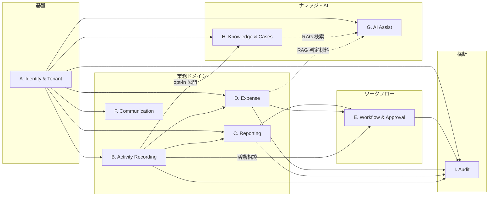

**読み方:**
- **A(Identity & Tenant)** は全サブシステムの上位依存(`municipality_id` / `user_id` の供給元)
- **B → C / D**:活動記録が月報集計と経費計上の元データ
- **C / D / B → E**:承認対象は **汎用 approvals** に集約(target_table で多態)
- **B → H**:完了プロジェクトを opt-in で全国事例化(ADR-011)
- **H / D → G**:RAG で AI 相談 / 経費判定の引用材料
- **全 → I**:重要操作は audit_logs に流す

---

## 3. サブシステム別 ER 図

### 3.A Identity & Tenant

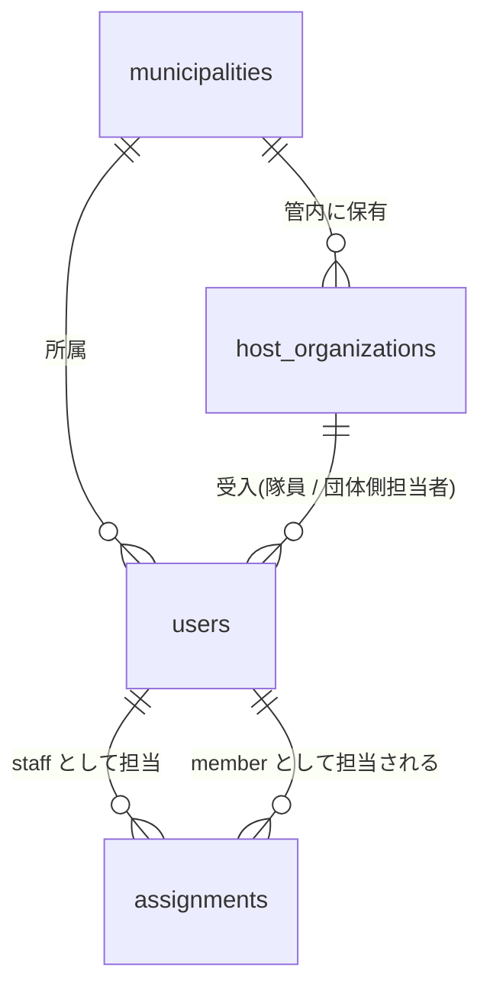

**説明:**
- マルチテナント分離の基盤。`users.role` で `member`(隊員)/ `manager`(役場 or 受入団体職員)/ `admin`(管理者)を識別。
- `users.organization_type` で `municipality`(役場職員)/ `host_org`(受入団体)を細分化(ADR-012)。
- `host_organizations` は受入団体マスタ。財布を握っている団体の承認権限を表現するために必要。
- `assignments` は職員 × 隊員の N:N 担当割当で、RLS の「管轄判定」に使われる。

---

### 3.B Activity Recording

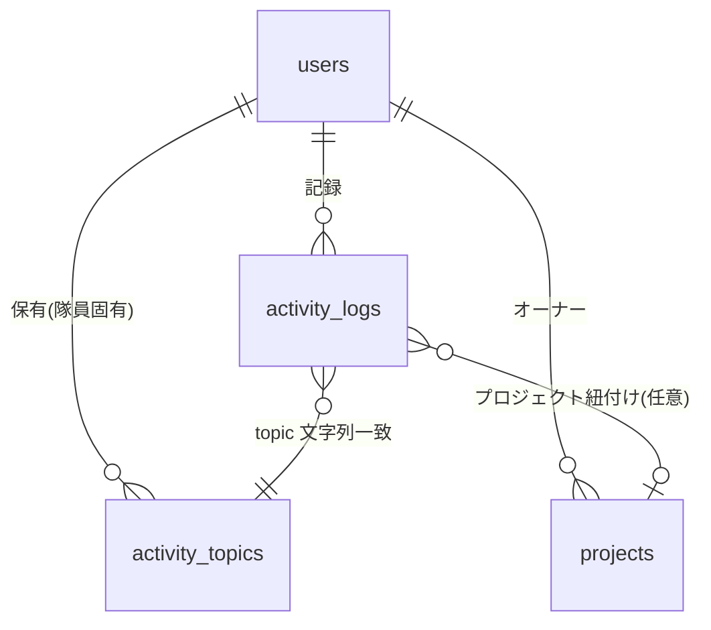

**説明:**
- `projects` は **計画 → 進行 → 完了** のライフサイクル管理。
- `activity_logs` は日次の行動記録。`project_id` は任意(雑務系の活動は紐付かない)。
- `activity_logs.distance_km` で車での移動距離を記録(MUST、ヒアリング反映)。
- 経費申請忘れ等で活動報告を編集する場合は通常の UPDATE。関連する月報が `approved` の場合は月報を `submitted` に戻すトリガーを発火させる(整合性保持)。
- `activity_topics` は隊員ごとの活動テーマテンプレ(例:空き家 / 移住相談)。`activity_logs.topic` は文字列で一致させる(柔軟性優先で FK にしない)。

---

### 3.C Reporting

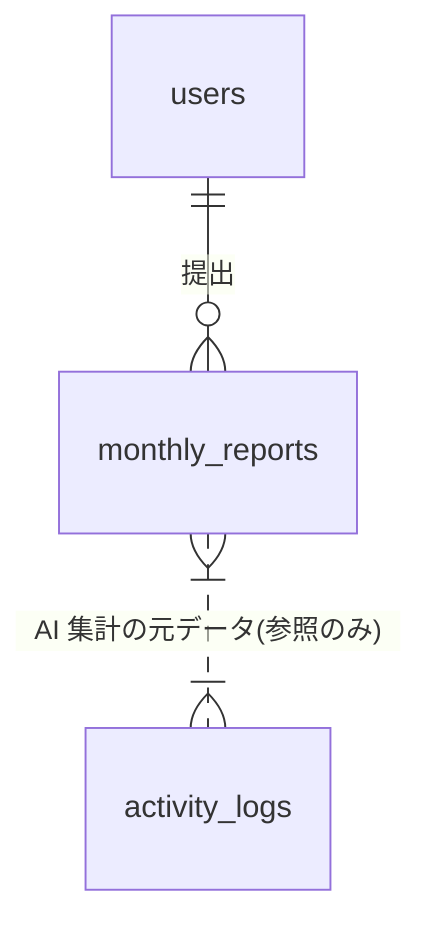

**説明:** 月単位の `(user_id, year_month)` 一意。`sections` 配列に AI 生成結果を JSONB で格納。`activity_logs` への参照は **論理的**(FK ではなく、集計クエリで紐付け)。

---

### 3.D Expense

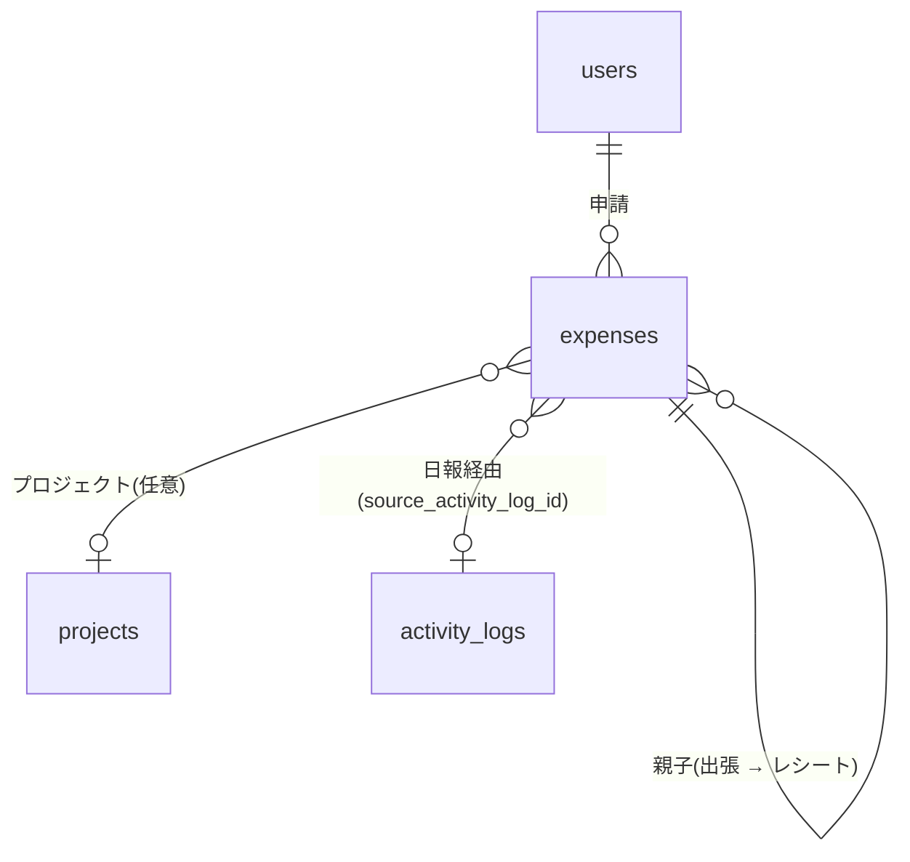

**説明(ADR-014):**
- `status` で申請 → 承認 → 精算のステートマシン管理。AI 判定材料(`ai_note` / `citations`)をキャッシュ。承認は **E. Workflow & Approval** が肩代わりする。
- **二系統動線**:
  - 動線①:日報経由 ─ `source_activity_log_id` + `source_receipt_index` で識別
  - 動線②:経費画面直接 ─ `source_activity_log_id IS NULL`
- **親子構造(旅費等)**:
  - 親:`expense_kind = trip_parent`、`amount_requested`(見積もり)を持つ
  - 子:`expense_kind = trip_receipt`、`parent_expense_id` で親に紐付け、各レシート 1 行
  - 親の `amount_settled` は子の合計値で自動集計
- **二重申請防止**:部分 UNIQUE INDEX で同一日報からの重複生成を DB レベルで防ぐ
- **編集ルール**:申請前は両画面から編集可、申請後は経費画面のみ(整合性保持)

---

### 3.E Workflow & Approval(多段階汎用ワークフロー)

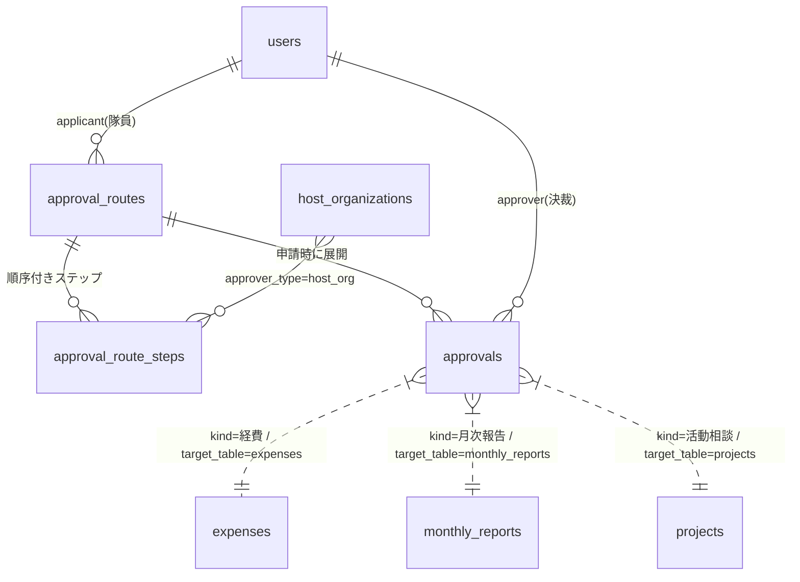

**説明(ADR-012):**
- `approval_routes` は **隊員 × 経費種別ごとのルート定義**(例:田中さんの経費は 担当課 → 受入団体 → 企画課)。
- `approval_route_steps` で各ステップを `step_no` の順に格納:`approver_type`(`dept` / `host_org` / `admin`)+ `approver_id`(具体ユーザー or NULL でロール解決)。
- 申請発生時に `approval_route_steps` を順に展開して `approvals` レコード群を生成。
- `approvals.step_no` で現在ステップを示し、上位 pending の間は下位は不可視。
- `kind` ∈ {経費 / 月次報告 / 活動相談}、`target_table` + `target_id` で対象レコードを多態参照。
- **差戻し時のみ `comment` 必須**(v3 仕様)。差戻しは初手ステップに戻す(全段やり直し)。
- ポリモーフィック参照のため FK は張らない(DB 制約ではなくアプリ層で整合性保証)。
- 既定ルートは自治体単位で 3 種類(シンプル / 中 / 複雑)を提供、隊員プロフィールで選択。

---

### 3.F Communication

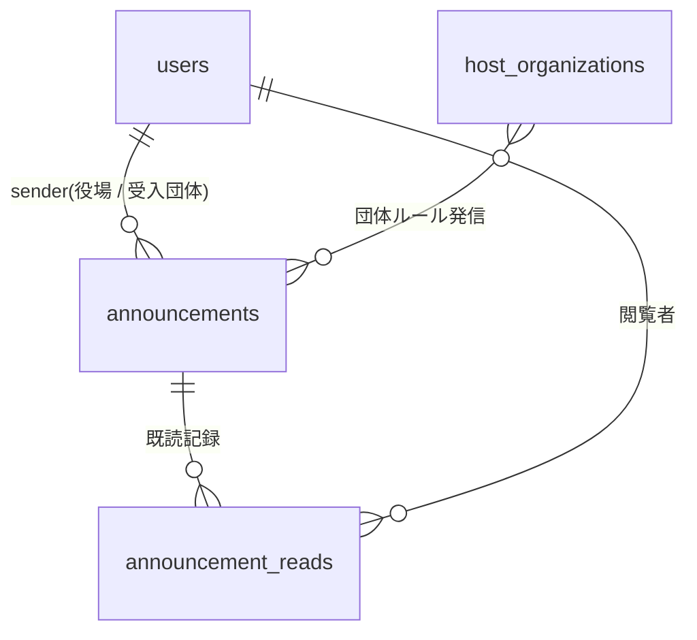

**説明(ADR-013):**
- お知らせは `target_user_ids` 配列で宛先を保持(全体送信 = 自治体内隊員全 ID)。
- `announcement_reads` で既読率を測る。
- **`kind`** で `info`(通常お知らせ)/ `rule`(ルール)/ `qa`(Q&A)を識別。
- **`is_pinned`** で常時固定表示。ルール / Q&A は基本ピン留め運用。
- 経費作成画面の「ルール参照ボタン」は `kind in ('rule', 'qa')` を絞り込み表示する(経費判定 段階 1)。
- 隊員側 UI は **右上ベル + ドロワー**(独立ページなし)。サイドメニューには追加しない。

---

### 3.G AI Assist

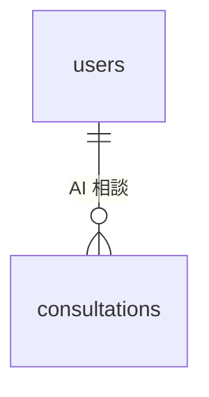

**説明:** AI 相談 / 経費判定 / 月報生成 等の使用履歴。`context_kind` で用途識別(`daily-write` / `report-plan` / `expense-purpose` / `case-find`)。コスト集計と「採用率」分析に使う。**学習データには使わない**(プライバシー)。

---

### 3.H Knowledge & Cases

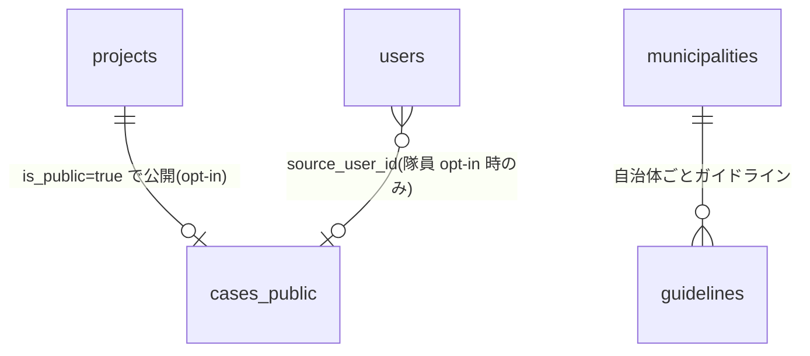

**説明(ADR-011 準拠):**
- `cases_public`:全テナント参照可能な匿名化済事例。**隊員=実名 opt-in / 自治体名=常公開 / 関係者=自動匿名化 / 公的団体=実名で残す**。
- `guidelines`:自治体ごとの活動費ガイドライン本文。経費判定 RAG の引用元。
- 双方 `embedding`(1536 次元)を保持し、pgvector で類似検索。

---

### 3.I Audit

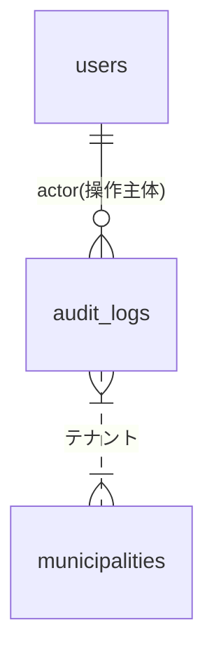

**説明:** 重要操作(承認 / 差戻し / 退任 / 公開化 等)を `actor_id` + `action` + `target_table` + `target_id` + `diff` で記録。**他サブシステムへの FK は張らない**(対象レコードが削除されてもログは残す方針)。

---

## 4. 全体 ER 図(リファレンス)

サブシステム横断で見たい場合の俯瞰図。詳細は §3 を参照。

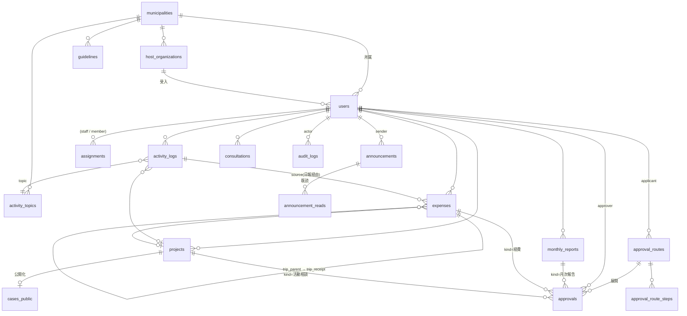

---

## 5. テーブル一覧

| サブシステム | テーブル | 説明 |
|---|---|---|
| A | `municipalities` | 自治体 |
| A | `host_organizations` | **受入団体マスタ(ADR-012)** |
| A | `users` | 全ロールのユーザー(隊員 / 役場職員 / 受入団体職員 / 管理者) |
| A | `assignments` | 職員 × 隊員 担当割当(N:N) |
| B | `activity_topics` | 活動内容テンプレ(隊員固有) |
| B | `activity_logs` | 日次活動記録(**移動距離含む**) |
| B | `projects` | プロジェクト(ライフサイクル管理) |
| C | `monthly_reports` | 月次報告 |
| D | `expenses` | 経費(申請 / 精算) |
| E | `approval_routes` | **承認ルート定義(隊員 × 経費種別、ADR-012)** |
| E | `approval_route_steps` | **承認ステップ(順序付き、ADR-012)** |
| E | `approvals` | 承認ワークフロー(汎用、kind で多態、`step_no` で現在ステップ) |
| F | `announcements` | お知らせ / ルール / Q&A(`kind` で区別、ADR-013) |
| F | `announcement_reads` | お知らせ既読 |
| G | `consultations` | AI 相談ログ |
| H | `cases_public` | 全国事例(匿名化済、公開) |
| H | `guidelines` | 自治体ガイドライン(経費 RAG の元) |
| I | `audit_logs` | 操作監査 |

---

## 6. テーブル定義

> 各テーブルの先頭にサブシステム識別子(A〜I)を付記する。

### 6.1 [A] municipalities

| カラム | 型 | NOT NULL | 説明 |
|---|---|---|---|
| id | uuid | ✓ | PK |
| name | text | ✓ | 自治体名(例:新温泉町) |
| prefecture | text | ✓ | 都道府県(例:兵庫県) |
| settings | jsonb |  | 自治体ごとの設定(年間活動費上限等) |
| created_at | timestamptz | ✓ | |

### 6.2 [A] host_organizations(ADR-012)

受入団体マスタ。財布を握っている団体の承認権限を表現するために必要。

| カラム | 型 | NOT NULL | 説明 |
|---|---|---|---|
| id | uuid | ✓ | PK |
| municipality_id | uuid | ✓ | FK → municipalities |
| name | text | ✓ | 団体名(例:○○観光協会、△△農業法人) |
| kind | text |  | 任意:`観光協会` / `農業法人` / `NPO` 等 |
| contact_user_id | uuid |  | FK → users(団体長 / 承認者) |
| created_at | timestamptz | ✓ | |

**インデックス:** `(municipality_id, name)`

### 6.3 [A] users

| カラム | 型 | NOT NULL | 説明 |
|---|---|---|---|
| id | uuid | ✓ | PK(`auth.users.id` と同期) |
| municipality_id | uuid | ✓ | FK → municipalities |
| host_organization_id | uuid |  | FK → host_organizations(隊員の受入団体 / 団体側担当者の所属) |
| organization_type | text | ✓ | `municipality`(役場職員)/ `host_org`(受入団体)/ `member`(隊員所属なし) |
| role | text | ✓ | `member` / `manager` / `admin` |
| name | text | ✓ | 表示名 |
| email | text | ✓ | UNIQUE |
| role_label | text |  | 隊員の役割(例:移住促進) |
| title | text |  | 役場職員の役職 |
| department | text |  | 役場職員の所属課(例:商工観光 / 企画) |
| term | text |  | 隊員の任期(例:1 年目) |
| started_at | date |  | 着任日 |
| status | text | ✓ | `active` / `retired`(退任) |
| approval_route_id | uuid |  | FK → approval_routes(隊員に割り当てられた既定ルート、ADR-012) |
| disclose_name_in_cases | bool | ✓ | **事例公開時に実名を出すか(opt-in、デフォルト false)** |
| bio | text |  | プロフィール紹介文(公開事例の隊員プロフィールに表示) |
| contact_form_enabled | bool | ✓ | 連絡フォーム受付(Year 2、デフォルト false) |
| created_at | timestamptz | ✓ | |
| updated_at | timestamptz | ✓ | |

**インデックス:**
- `(municipality_id, role)`
- `(municipality_id, status)`
- `(host_organization_id)`

### 6.4 [A] assignments

| カラム | 型 | NOT NULL | 説明 |
|---|---|---|---|
| id | uuid | ✓ | PK |
| municipality_id | uuid | ✓ | FK → municipalities |
| staff_id | uuid | ✓ | FK → users(役場担当) |
| member_id | uuid | ✓ | FK → users(隊員) |
| created_at | timestamptz | ✓ | |

**UNIQUE:** `(staff_id, member_id)`

### 6.5 [B] activity_topics

| カラム | 型 | NOT NULL | 説明 |
|---|---|---|---|
| id | uuid | ✓ | PK |
| user_id | uuid | ✓ | FK → users(隊員固有) |
| municipality_id | uuid | ✓ | FK → municipalities(RLS 用、冗長) |
| name | text | ✓ | 活動内容名(例:空き家) |
| sort_order | int | ✓ | 表示順 |
| created_at | timestamptz | ✓ | |

**UNIQUE:** `(user_id, name)`

### 6.6 [B] activity_logs

| カラム | 型 | NOT NULL | 説明 |
|---|---|---|---|
| id | uuid | ✓ | PK |
| user_id | uuid | ✓ | FK → users(隊員) |
| municipality_id | uuid | ✓ | FK → municipalities(RLS) |
| project_id | uuid |  | FK → projects(任意紐付け) |
| activity_type | text | ✓ | 活動の種類(会議/出張/...) |
| topic | text | ✓ | 活動内容(activity_topics.name と一致) |
| hours | numeric(4,1) | ✓ | 活動時間(0.5 単位) |
| distance_km | numeric(6,1) |  | **車での移動距離(km、MUST)** |
| body | text | ✓ | メモ |
| occurred_at | timestamptz | ✓ | 実際の活動日時 |
| expense_amount | int |  | この活動で発生した経費(円) |
| photo_paths | text[] |  | Storage パス配列 |
| created_at | timestamptz | ✓ | |
| updated_at | timestamptz | ✓ | |

**インデックス:**
- `(user_id, occurred_at DESC)`
- `(municipality_id, occurred_at DESC)`

### 6.7 [B] projects

| カラム | 型 | NOT NULL | 説明 |
|---|---|---|---|
| id | uuid | ✓ | PK |
| user_id | uuid | ✓ | FK → users(オーナー隊員) |
| municipality_id | uuid | ✓ | FK → municipalities |
| name | text | ✓ | プロジェクト名(例:空き家コワーキング) |
| goal | text |  | 目的・ゴール |
| background | text |  | 背景 |
| plan | text |  | 実施計画 |
| kpi | text |  | KPI |
| period_start | date |  | 開始日 |
| period_end | date |  | 終了日 |
| budget | int |  | 予算(円) |
| risk | text |  | リスクと対策 |
| status | text | ✓ | `planning` / `active` / `completed` |
| is_public | bool | ✓ | true で全国事例化 opt-in |
| disclose_name_override | bool |  | NULL = users.disclose_name_in_cases に従う / true / false の上書き |
| anonymized_case_id | uuid |  | FK → cases_public(匿名化後の参照) |
| created_at | timestamptz | ✓ | |
| updated_at | timestamptz | ✓ | |

### 6.8 [C] monthly_reports

| カラム | 型 | NOT NULL | 説明 |
|---|---|---|---|
| id | uuid | ✓ | PK |
| user_id | uuid | ✓ | FK → users |
| municipality_id | uuid | ✓ | FK → municipalities |
| year_month | text | ✓ | "2026-05" |
| status | text | ✓ | `draft` / `submitted` / `approved` / `rejected` |
| summary | text |  | サマリ章 |
| sections | jsonb |  | 5 章の本文配列 `[{title, body}]` |
| plan_next | text |  | 来月計画 |
| activity_count | int | ✓ | 自動集計:活動件数 |
| total_hours | numeric(6,1) | ✓ | 自動集計:総活動時間 |
| total_expense | int | ✓ | 自動集計:総経費 |
| submitted_at | timestamptz |  | 提出日時 |
| ai_generated_at | timestamptz |  | AI 生成日時 |
| created_at | timestamptz | ✓ | |
| updated_at | timestamptz | ✓ | |

**UNIQUE:** `(user_id, year_month)`

### 6.9 [D] expenses(ADR-014)

| カラム | 型 | NOT NULL | 説明 |
|---|---|---|---|
| id | uuid | ✓ | PK |
| user_id | uuid | ✓ | FK → users |
| municipality_id | uuid | ✓ | FK → municipalities |
| project_id | uuid |  | FK → projects |
| **expense_kind** | text | ✓ | `single`(単発)/ `trip_parent`(出張見積もり)/ `trip_receipt`(出張レシート)、ADR-014 |
| **parent_expense_id** | uuid |  | FK → expenses(`trip_receipt` の場合の親、ADR-014) |
| **source_activity_log_id** | uuid |  | FK → activity_logs(日報経由動線、ADR-014) |
| **source_receipt_index** | int |  | 同一日報内の何枚目のレシートか(0-based、ADR-014) |
| title | text | ✓ | タイトル(AI 自動生成、編集可) |
| amount_requested | int | ✓ | 申請金額(円) |
| amount_settled | int |  | 実支出額(精算時、`trip_parent` は子の合計で自動更新) |
| purpose | text | ✓ | 用途・内容 |
| status | text | ✓ | `下書き` / `申請中` / `承認` / `差戻し` / `未精算` / `精算済` / `取下げ` |
| period_start | date |  | 出張等の開始日(`trip_parent` のみ) |
| period_end | date |  | 出張等の終了日(`trip_parent` のみ) |
| payee | text |  | 支払先(精算時) |
| paid_date | date |  | 支出日(精算時) |
| receipt_path | text |  | 領収書 Storage パス |
| settle_note | text |  | 精算メモ |
| ai_note | text |  | AI 判定材料(キャッシュ) |
| citations | jsonb |  | 引用 `[{source, quote}]` |
| created_at | timestamptz | ✓ | |
| updated_at | timestamptz | ✓ | |

**インデックス:**
- `(user_id, status)`
- `(municipality_id, status)`
- `(parent_expense_id)` ─ 親子集計用
- **部分 UNIQUE**:`(source_activity_log_id, source_receipt_index) WHERE source_activity_log_id IS NOT NULL` ─ 二重申請防止(ADR-014)

**トリガー:**
- `trip_receipt` の INSERT / UPDATE 時に親(`trip_parent`)の `amount_settled` を集計値で更新
- `status` 遷移時に `audit_logs` に記録

### 6.10 [E] approval_routes(ADR-012)

承認ルート定義(隊員 × 経費種別ごと)。

| カラム | 型 | NOT NULL | 説明 |
|---|---|---|---|
| id | uuid | ✓ | PK |
| municipality_id | uuid | ✓ | FK → municipalities |
| name | text | ✓ | ルート名(例:`シンプル(企画課のみ)` / `中(担当課 → 企画課)` / `複雑(担当課 → 受入団体 → 企画課)`) |
| kind | text | ✓ | `経費` / `月次報告` / `活動相談` |
| is_default | bool | ✓ | 自治体既定ルートか |
| created_at | timestamptz | ✓ | |

**インデックス:** `(municipality_id, kind, is_default)`

### 6.11 [E] approval_route_steps(ADR-012)

承認ルートの各ステップ(順序付き)。

| カラム | 型 | NOT NULL | 説明 |
|---|---|---|---|
| id | uuid | ✓ | PK |
| route_id | uuid | ✓ | FK → approval_routes |
| step_no | int | ✓ | 1 から始まる順序 |
| approver_type | text | ✓ | `dept`(役場担当課)/ `host_org`(受入団体)/ `admin`(企画課・全体取りまとめ) |
| approver_id | uuid |  | 具体ユーザー固定(NULL なら type からロール解決) |
| host_organization_id | uuid |  | `approver_type = host_org` の場合の団体指定 |
| department | text |  | `approver_type = dept` の場合の課名(例:`商工観光`) |
| created_at | timestamptz | ✓ | |

**UNIQUE:** `(route_id, step_no)`

### 6.12 [E] approvals

承認ワークフローを汎用化(月次 / 経費 / 活動相談)。

| カラム | 型 | NOT NULL | 説明 |
|---|---|---|---|
| id | uuid | ✓ | PK |
| municipality_id | uuid | ✓ | FK → municipalities |
| route_id | uuid | ✓ | FK → approval_routes(申請時に展開元として記録) |
| kind | text | ✓ | `経費` / `月次報告` / `活動相談` |
| applicant_id | uuid | ✓ | FK → users(隊員) |
| approver_id | uuid |  | FK → users(該当ステップの決裁者) |
| target_table | text | ✓ | `expenses` / `monthly_reports` / `projects` |
| target_id | uuid | ✓ | 対象レコード ID |
| step_no | int | ✓ | このレコードのステップ番号(ADR-012) |
| total_steps | int | ✓ | ルート全体のステップ数(進行可視化用) |
| status | text | ✓ | `pending` / `approved` / `rejected` / `skipped`(上位差戻しで戻された場合) |
| ai_note | text |  | AI 判定材料 |
| citations | jsonb |  | 引用 |
| comment | text |  | 役場コメント(差戻し時必須) |
| approved_at | timestamptz |  | |
| created_at | timestamptz | ✓ | |

**インデックス:**
- `(municipality_id, status)`
- `(applicant_id, status)`
- `(target_table, target_id, step_no)`

**注意:** 差戻し時は同 `target_id` の全 `approvals` レコードを `rejected` にし、起票者に再申請を求める。再申請で新規 route 展開。

### 6.13 [F] announcements(ADR-013)

| カラム | 型 | NOT NULL | 説明 |
|---|---|---|---|
| id | uuid | ✓ | PK |
| municipality_id | uuid | ✓ | FK → municipalities |
| host_organization_id | uuid |  | FK → host_organizations(団体発信のルール等) |
| sender_id | uuid | ✓ | FK → users(役場 / 受入団体) |
| kind | text | ✓ | `info`(通常)/ `rule`(ルール)/ `qa`(Q&A、ADR-013) |
| is_pinned | bool | ✓ | true で常時固定表示(ルール / Q&A は基本 true) |
| title | text | ✓ | (本文先頭から自動抽出可能) |
| body | text | ✓ | お知らせ本文 |
| target_user_ids | uuid[] | ✓ | 送信先隊員 ID 配列(全体送信時は管轄全 ID) |
| sent_at | timestamptz | ✓ | |
| created_at | timestamptz | ✓ | |

**インデックス:**
- `(municipality_id, kind, is_pinned)` ─ ルール参照ボタンの絞り込み用
- `(municipality_id, sent_at DESC)` ─ 時系列表示用

### 6.14 [F] announcement_reads

| カラム | 型 | NOT NULL | 説明 |
|---|---|---|---|
| announcement_id | uuid | ✓ | PK(複合) |
| user_id | uuid | ✓ | PK(複合) |
| read_at | timestamptz | ✓ | |

### 6.15 [G] consultations

AI 相談のログ。学習データではなく、隊員の使用履歴として保持。

| カラム | 型 | NOT NULL | 説明 |
|---|---|---|---|
| id | uuid | ✓ | PK |
| user_id | uuid | ✓ | FK → users |
| municipality_id | uuid | ✓ | FK → municipalities |
| context_kind | text | ✓ | `daily-write` / `report-plan` / `expense-purpose` / `case-find` |
| context_payload | jsonb |  | 入力時のコンテキスト |
| input_text | text | ✓ | ユーザー入力 |
| output_text | text | ✓ | AI 応答 |
| adopted | bool | ✓ | 「反映して閉じる」を押したか |
| tokens_used | int |  | コスト集計用 |
| created_at | timestamptz | ✓ | |

### 6.16 [H] cases_public

**ADR-011 に準拠した公開事例。隊員は実名 opt-in、関係者は自動匿名化、自治体名は常に公開。**

| カラム | 型 | NOT NULL | 説明 |
|---|---|---|---|
| id | uuid | ✓ | PK |
| source_project_id | uuid | ✓ | 元プロジェクト ID(隊員側で参照可能) |
| source_municipality_id | uuid | ✓ | 元自治体 ID(常に公開:`municipality_name` を結合表示) |
| source_user_id | uuid |  | 元隊員 ID(opt-in 時のみ非 NULL、隊員プロフィールへの導線) |
| municipality_name | text | ✓ | 例:「新温泉町」(常に公開) |
| prefecture | text | ✓ | 例:「兵庫県」 |
| disclose_author | bool | ✓ | true なら隊員名を author_label に表示 |
| author_label | text | ✓ | opt-in:「田中 あかり」/ opt-out:「移住促進担当」 |
| year | text | ✓ | 例:"2024" |
| title | text | ✓ | |
| summary | text | ✓ | **関係者匿名化済**(個人名 → 「A さん」、民間企業 → 「地元の小売店」) |
| kpi | text |  | |
| effect | text |  | |
| process | jsonb |  | プロセス配列(各 phase.body も匿名化済) |
| learning | text |  | 学び(匿名化済) |
| original_text | text |  | 匿名化前テキスト(自治体内のみ参照可、監査用) |
| anonymized_at | timestamptz | ✓ | 匿名化処理完了日時 |
| anonymized_by_review | bool | ✓ | 隊員レビュー完了済か(false なら下書き状態) |
| embedding | vector(1536) |  | pgvector 用 |
| created_at | timestamptz | ✓ | |

**インデックス:**
- HNSW on `embedding`(類似検索)
- 全文検索 GIN on `title || summary || learning`
- `(prefecture, municipality_name)` で自治体別検索

**RLS:**
- `anonymized_by_review = true` の行のみ全テナントから SELECT 可能
- 下書き状態(`anonymized_by_review = false`)は原著隊員と同自治体管理者のみ参照可能
- `original_text` は同自治体ユーザーのみ参照可能(他テナントは NULL マスク)
- INSERT は Edge Function(匿名化処理経由)のみ
- UPDATE は原著隊員(`source_user_id`)が `anonymized_by_review` のトグルのみ可能

**匿名化方針(ADR-011):**
- **隊員名:** `disclose_author = true` なら実名、false なら役割名
- **自治体名:** 常に公開
- **関係者 個人名 → 匿名化**(「A さん」「住民の方」)
- **民間企業 → 匿名化**(「地元の小売店」「町内の建設会社」)
- **公的団体(自治会・観光協会・学校等)→ 実名で残す**(文脈価値を保つため)

### 6.17 [H] guidelines

自治体ごとの活動費ガイドライン(経費 RAG の元データ)。

| カラム | 型 | NOT NULL | 説明 |
|---|---|---|---|
| id | uuid | ✓ | PK |
| municipality_id | uuid | ✓ | FK → municipalities |
| source | text | ✓ | 例:「新温泉町 活動費ガイドライン v2.1」 |
| section | text | ✓ | 章タイトル |
| body | text | ✓ | 条文本文 |
| embedding | vector(1536) |  | pgvector 用 |
| created_at | timestamptz | ✓ | |

### 6.18 [I] audit_logs

| カラム | 型 | NOT NULL | 説明 |
|---|---|---|---|
| id | uuid | ✓ | PK |
| municipality_id | uuid | ✓ | FK → municipalities |
| actor_id | uuid | ✓ | FK → users |
| action | text | ✓ | 例:`approve` / `reject` / `member.retire` |
| target_table | text | ✓ | |
| target_id | uuid | ✓ | |
| diff | jsonb |  | 変更前後 |
| created_at | timestamptz | ✓ | |

**インデックス:**
- `(municipality_id, created_at DESC)`
- `(target_table, target_id)`

---

## 7. RLS ポリシー(主要 7 件)

```sql
-- 1. [B] activity_logs: 隊員 = 自分のみ / 役場 = 管轄隊員 / 管理者 = 自治体全員
CREATE POLICY "activity_logs_select" ON activity_logs FOR SELECT TO authenticated USING (
  municipality_id = current_municipality_id()
  AND (
    user_id = auth.uid()
    OR EXISTS (SELECT 1 FROM assignments WHERE staff_id = auth.uid() AND member_id = activity_logs.user_id)
    OR is_admin()
  )
);

-- 2. [D] expenses: 同上
CREATE POLICY "expenses_select" ON expenses FOR SELECT TO authenticated USING (...);

-- 3. [C] monthly_reports: 同上
CREATE POLICY "monthly_reports_select" ON monthly_reports FOR SELECT TO authenticated USING (...);

-- 4. [E] approvals: 起票者 / 決裁者 / 管理者
CREATE POLICY "approvals_select" ON approvals FOR SELECT TO authenticated USING (
  municipality_id = current_municipality_id()
  AND (applicant_id = auth.uid() OR approver_id = auth.uid() OR is_manager_for(applicant_id) OR is_admin())
);

-- 5. [H] cases_public: 全テナント SELECT 可能(レビュー完了済のみ)
CREATE POLICY "cases_public_select" ON cases_public FOR SELECT TO authenticated USING (anonymized_by_review = true);

-- 6. [A] assignments: 自治体内のみ参照可能
CREATE POLICY "assignments_select" ON assignments FOR SELECT TO authenticated USING (
  municipality_id = current_municipality_id()
);

-- 7. [F] announcements: 送信者 / 受信対象 / 管理者
CREATE POLICY "announcements_select" ON announcements FOR SELECT TO authenticated USING (
  municipality_id = current_municipality_id()
  AND (sender_id = auth.uid() OR auth.uid() = ANY(target_user_ids) OR is_admin())
);
```

**ヘルパー関数:**
```sql
CREATE FUNCTION current_municipality_id() RETURNS uuid AS $$
  SELECT municipality_id FROM users WHERE id = auth.uid();
$$ LANGUAGE sql STABLE;

CREATE FUNCTION is_admin() RETURNS bool AS $$
  SELECT EXISTS (SELECT 1 FROM users WHERE id = auth.uid() AND role = 'admin');
$$ LANGUAGE sql STABLE;
```

---

## 8. Storage バケット構造

```
receipts/                       # [D] Expense
└── {municipality_id}/
    └── {user_id}/
        └── {expense_id}/{filename}

photos/                         # [B] Activity Recording
└── {municipality_id}/
    └── {user_id}/
        └── {YYYY-MM}/
            └── {activity_log_id}/{filename}

reports/                        # [C] Reporting
└── {municipality_id}/
    └── {user_id}/
        └── {year_month}.pdf
```

**ポリシー:**
- 隊員は自分のパス配下のみ R/W
- 役場は管轄隊員のパスを R(W は不可)
- 管理者は自治体内すべて R/W

---

## 9. Embedding と RAG(サブシステム G / H)

### 9.1 Embedding 戦略
- モデル:`text-embedding-3-small`(1536 次元)
- 対象:
  - `cases_public`(全文 = title + summary + learning + process JSON 文字列)
  - `guidelines`(`source + section + body`)
- 更新タイミング:
  - 事例:Edge Function の cron で日次
  - ガイドライン:管理画面で更新時に再計算

### 9.2 検索フロー(経費 RAG)
1. `purpose` を Embedding
2. `cases_public` で類似 3 件取得
3. `guidelines` で同一自治体の関連 1-2 件取得
4. Claude に「判定材料を整理してください」プロンプト
5. キャッシュ:`expenses.ai_note` + `expenses.citations` に保存

---

## 10. マイグレーション戦略

### 10.1 PoC 時点
- Supabase の SQL Editor で直接スキーマを作成
- マイグレーションファイル(`supabase/migrations/`)で履歴管理

### 10.2 ファイル命名(サブシステム単位で分割)
```
supabase/migrations/
├── 20260612_001_identity.sql        # [A] municipalities, users, assignments, RLS 基礎
├── 20260612_002_activities.sql      # [B] activity_logs, projects, topics
├── 20260612_003_reporting.sql       # [C] monthly_reports
├── 20260612_004_expenses.sql        # [D] expenses
├── 20260612_005_workflow.sql        # [E] approvals
├── 20260612_006_communication.sql   # [F] announcements + reads
├── 20260612_007_ai_knowledge.sql    # [G] consultations / [H] cases_public, guidelines, embeddings
└── 20260612_008_audit.sql           # [I] audit_logs + triggers
```

### 10.3 シードデータ(PoC)
- 自治体:新温泉町
- 管理者:1 名
- 役場担当:1-2 名
- 隊員:5 名(田中 あかり 等のモック名でも実名でも可)
- 活動内容テンプレ:空き家 / 移住相談 / 町報 / 観光協会 / 夏祭り
- ガイドライン:1 自治体分(10-20 セクション)
- 全国事例:10-30 件(JOIN お役立ちツール Q&A、海士町 / 養父市 / 豊岡 等)

---

## 11. データ容量見積もり(1 自治体・1 年)

| サブシステム | テーブル | 行数 | 1 行サイズ | 合計 |
|---|---|---|---|---|
| B | activity_logs | 5 名 × 250 日 × 2 件 = 2,500 | 2 KB | 5 MB |
| D | expenses | 5 名 × 20 件 = 100 | 2 KB | 0.2 MB |
| C | monthly_reports | 5 名 × 12 月 = 60 | 10 KB | 0.6 MB |
| B | projects | 5 名 × 5 件 = 25 | 4 KB | 0.1 MB |
| E | approvals | 5 名 × 30 件 = 150 | 1 KB | 0.15 MB |
| F | announcements | 50 件 | 2 KB | 0.1 MB |
| G | consultations | 5 名 × 200 件 = 1,000 | 4 KB | 4 MB |
| I | audit_logs | 5,000 件 | 1 KB | 5 MB |
| **DB 合計** | | | | **約 15 MB / 自治体 / 年** |
| Storage(領収書 + 写真) | | | | **約 500 MB / 自治体 / 年** |

Supabase Free Tier(500MB DB + 1GB Storage)で 1 自治体 5 年分は余裕。

---

## 12. バックアップとリストア

- Supabase 標準の **日次バックアップ**(7 日保持、Pro プラン)
- 月次フルダンプを手動で取得し、別リージョン S3 に保存(Year 2)
- リストア手順:管理者がチケット起票 → 24 時間以内に復元

---

## 13. プライバシー・退任時のデータ取扱

| イベント | データ動作 |
|---|---|
| 隊員退任(active → retired) | データは保持。閲覧は本人 + 管理者のみ可能。 |
| 退任 30 日経過 | 監査ログ以外の個人特定情報をマスク(本人申請でエクスポート可) |
| 完了プロジェクト + opt-in | 匿名化フローで cases_public に投入(ADR-011) |
| 自治体契約解除 | 90 日以内に全データ削除(本人申請でエクスポート可) |

---

## 14. 将来の拡張(Year 2+)

| 追加サブシステム / テーブル | 用途 |
|---|---|
| **[B 拡張]** `voice_logs` | Whisper による音声記録 |
| **[F 拡張]** `push_subscriptions` | PWA Push 通知 |
| **新規 [J] Prefecture Dashboard** | 県横断モード(`prefecture_dashboards`) |
| **[C 拡張]** `legislative_reports` | 議会報告 PDF |
| **新規 [K] Career** | キャリア着地点ナビ(`careers`) |
| **新規 [L] Contact** | 事例 → 隊員 連絡フォーム(`contact_messages`、ADR-011) |

`contact_messages` の仕様(Year 2):
- `from_user_id` / `to_user_id` / `case_id` / `body` / `read_at`
- 隊員のメアドは非公開、システム内で配送
- スパム対策:同一送信者から同一受信者へは 1 日 3 件まで
- 送信時に Resend で通知メール(本文プレビュー + システム内 URL)
